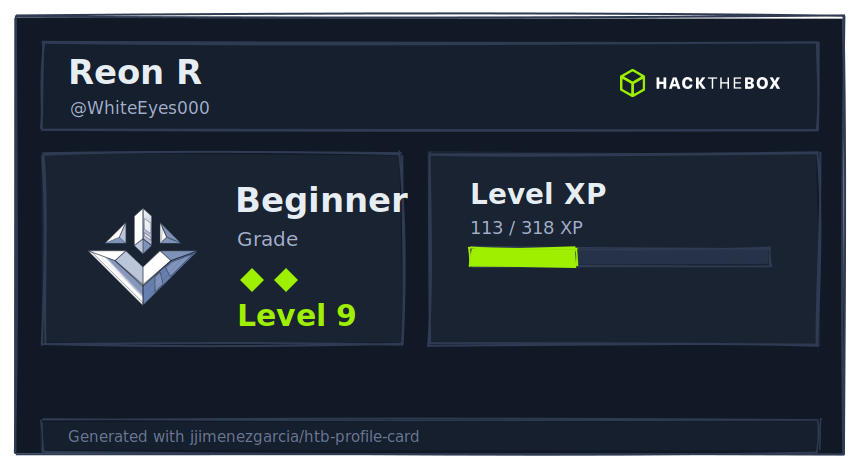
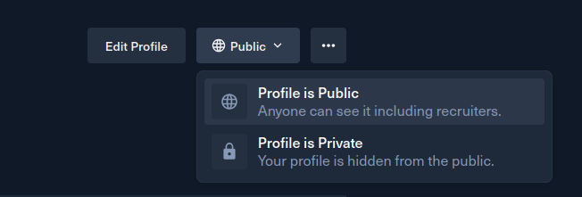

<div align="center">


# HTB README Card

Generate a Hack The Box profile card as an SVG for your GitHub README.



</div>

---

> [!WARNING]
> This project is an unofficial community project and is not affiliated with, endorsed by, or sponsored by Hack The Box.
>
> All Hack The Box artwork, logos, branding, visual assets, and related intellectual property belong to Hack The Box.
>
> This repository is intended for personal and educational purposes only.  
> No copyright infringement is intended and no commercial use is made from HTB assets.


---

# Setting things up
## Public Profile Requirement

Your Hack The Box profile must be public.

Go to https://profile.hackthebox.com/ and enable your public profile visibility.

Example:

<p align="center">
  
</p>

---

## Getting Your Profile ID

Open your Hack The Box profile menu and, on the three dots at the very right, click:

```text
View Public Profile
```

You will be redirected to a URL like:

```text
https://profile.hackthebox.com/profile/xxxxxxx
```

The profile ID is the final part:

```text
xxxxxxx
```

---

# Alternatives
## Reusable GitHub Workflow (recommended)

This repository exposes a reusable GitHub Actions workflow that will automatically update your card on your profile.

Create this file in your own repository:

```text
.github/workflows/htb-readme-card.yml
```

```yml
name: Update HTB Card

on:
  schedule:
    - cron: "0 */12 * * *"

  workflow_dispatch:

jobs:
  update-card:
    permissions:
      contents: write

    uses: jjimenezgarcia/htb-readme-card/.github/workflows/htb-readme-card.yml@main

    with:
      profile_id: <your-htb-profile-id>
      output_file: assets/htb-card.svg
```

Then reference the generated SVG inside the target repository README:

```md

```


## Manual Usage

Install dependencies:

```bash
npm install
```

Generate the SVG card:

```bash
npm run generate -- 019dcc3b-1360-710a-b951-137599456ed5
```

The generated SVG will be saved at:

```text
dist/htb-card.svg
```

You can then include it in your README:

```md

```